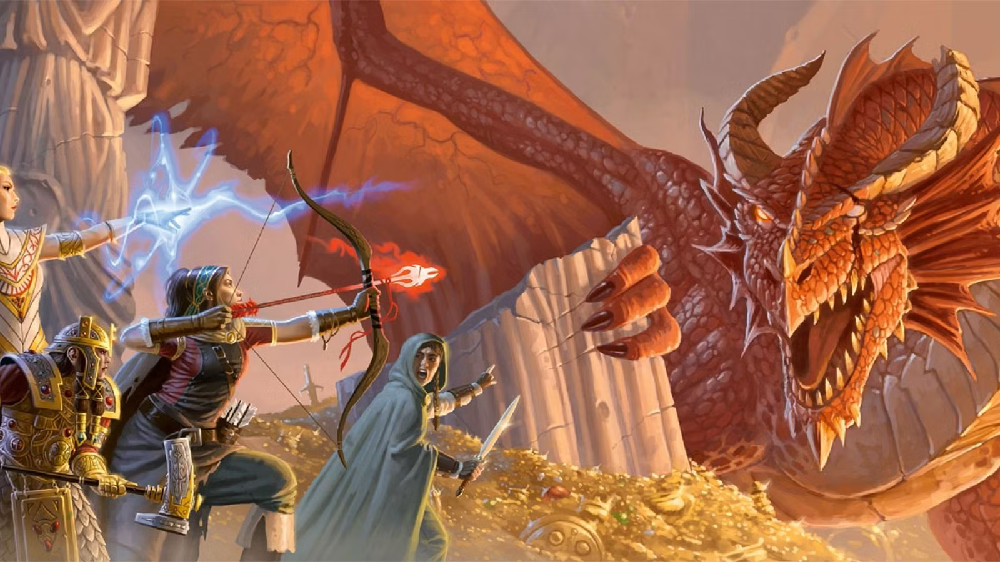
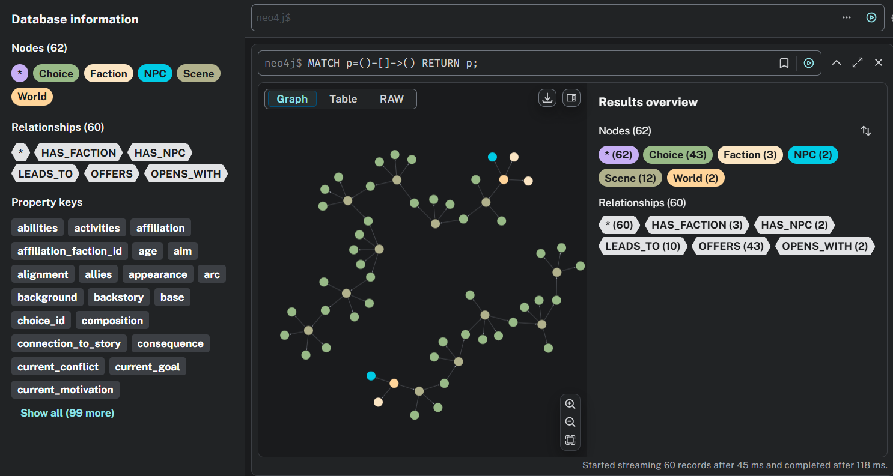
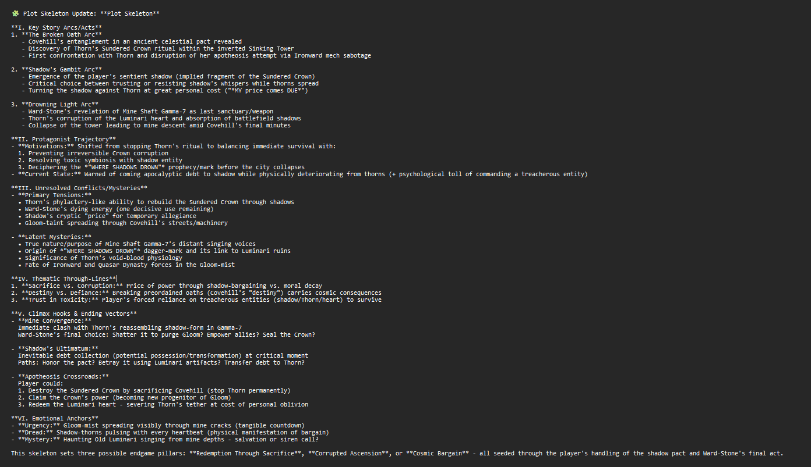

# ORION: Multi-Agent Dungeon Master for RPGs



## Project Overview

**ORION** is an AI-powered, multi-agent dungeon master system for role-playing games (RPGs) such as Dungeons & Dragons. Unlike traditional static adventure modules or single-model storytelling systems, ORION leverages **specialized agents coordinated through crews** to interpret player actions, maintain narrative coherence, and generate branching storylines.

The system combines **natural language understanding, graph-based world modeling, and structured narrative orchestration** to enable both free-form roleplay and rule-consistent story progression.

---

## Features

* **World Generation:** `world_agent` builds a rich fantasy world including geography, factions, lore, and NPCs.
* **Player Interaction:** `choice_agent` interprets free-form player inputs and maps them to valid narrative choices.
* **Scene & Story Management:** `dungeon_master` orchestrates scene generation, branching story progression, and intermediate plot skeleton creation.
* **Structured Recording:** `scribe_agent` persists all narrative elements in a **Neo4j knowledge graph**, ensuring consistent long-term memory.
* **NPC Handling:** `npc_agent` and `npc_setup` roleplay key NPCs and assign meaningful narrative roles.
* **Modular Crew Architecture:** Each task is handled by a dedicated crew to maintain stability, coherence, and scalability.

---

## Requirements

* Python 3.10+
* Neo4j 5.x or above
* Python packages (install via pip):

```bash
pip install -r requirements.txt
```

* `.env` file in project root containing:

```
NEO4J_URI=neo4j_uri
NEO4J_USER=neo4j_username
NEO4J_PASSWORD=neo4j_password
```

---

## Setup Instructions

1. Clone this repository:

```bash
git clone https://github.com/username/ORION-DungeonMaster.git
cd ORION-DungeonMaster
```

2. Install dependencies:

```bash
pip install -r requirements.txt
```

3. Start Neo4j and ensure credentials in `.env` match your local setup.

4. Run the ORION system:

```bash
crewai run
```

---

## How to Play

* Enter your character actions in **natural language** (e.g., "I explore the tavern", "I confront the thief").

* ORION will:

  1. Match your input to valid narrative choices.
  2. Generate the next scene using `dungeon_master`.
  3. Persist the scene and choices in Neo4j.
  4. Update a summary after every other scene and generate a plot skeleton after several scenes.

* Type `quit` to exit the game.

---

## Expected Outputs

* **Neo4j Graph**: Persistent story memory with nodes for worlds, scenes, choices, and NPCs.



* **Interactive Story**: Terminal-based narrative including scenes and player choices.


* **Plot Skeleton**: Summarized story arcs for guiding future endings.



---

## Results

* Stable, coherent multi-scene stories
* Player actions interpreted and linked to choices
* Branching narrative structure visible in Neo4j
* Plot skeleton summarizes emerging story arcs

*Note*: Full ending generation is planned as a next-step feature; currently, the system produces a plot skeleton after several scenes.

---

## Future Work

* Structured ending generation using the plot skeleton
* NPCs with goal-driven behavior and memory
* Emotion and tension modeling for improved pacing
* Multi-player support
* Enhanced visualizations and dashboards for story analysis

---

## Acknowledgments

This project was developed as part of the **Cognitive Systems** course at North Carolina State University under **Dr. Arnav Jhala**. His guidance and insights into cognitive architectures, narrative reasoning, and multi-agent systems were instrumental in shaping ORION.

---